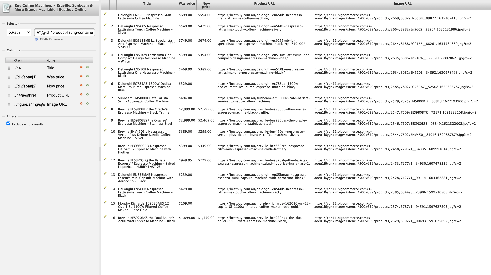

# Python Developer Tasks

This project is developed to complete the tasks given for the Python Developer role application. 

## Tasks
There are three different tasks in total:

- Using Scraper Chrome Extention
  - Scrape Peter's of Kensington
  - Scrape Best Buy product Summary
- Scrape Aldi's website using Python
- Test Regular Expression

## Task1: Chrome Scraper extension
This task was completed using the extension and results are screenshot. The results as well as the XPaths are visible in the screenshot, please find them here:

- 
- 

## Task2: Scraping Aldi's page
This task is to scrape Aldi's groceries site and generate CSV file. The scraper file is `main.py` and the resulted `csv` is `products_info.csv` at the root of this project.

## Task3: Regular Expression
This task is to work on three sub tasks:
1. extract count number from text
    - ./Regex/count_regex.py
2. extract file name from URLs
    - ./Regex/url_regex.py
3. regex out the `JSON` from `JavaScript` and load it into `Python`'s Datatype.
    - ./Regex/script_regex.py